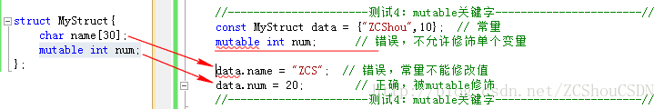

## C++ 常用关键字

### extern关键字

1. extern可以置于变量或者函数前，以标示变量或者函数的定义在别的文件中，提示编译器遇到此变量和函数时在其他模块中寻找其定义。
2. 此外extern也可用来进行链接指定。（即C++与C函数的相互调用时，extern "C"）。

**具体来说：**

1.  当extern与"C"一起连用时，如: extern "C" void fun(int a, int b);则告诉编译器在编译fun这个函数名时按着C的规则去翻译相应的函数名而不是C++的，C++的规则在翻译这个函数名时会把fun这个名字变得面目全非，可能是fun@aBc_int_int#%$也可能是别的，这要看编译器的"脾气"了(不同的编译器采用的方法不一样)，为什么这么做呢，因为C++支持函数的重载啊，在这里不去过多的论述这个问题，如果你有兴趣可以去网上搜索，相信你可以得到满意的解释!   

2.   当extern不与"C"在一起修饰变量或函数时，如在头文件中: extern int g_Int; 它的作用就是声明**函数或全局变量**的关键字。**记住它是一个声明不是定义!**也就是说B模块要引用A模块中定义的全局变量或函数时，它只要包含A模块的头文件即可,在编译阶段，B模块虽然找不到该函数或变量，但它不会报错，它会在连接时从模块A生成的目标代码中找到此函数。 

   

### static关键字

无论修饰局部变量还是全局变量，static都会使其生命周期变为整个程序的生命周期，并且带了默认初始化。

#### static 修饰局部变量

- 一般情况下，对于局部变量是存放在栈区的，并且局部变量的生命周期在该语句块执行结束时便结束了。
- 但是如果用static进行修饰的话，该变量便存放在静态数据区，其生命周期一直持续到整个程序执行结束。
- static修饰局部变量，其生命周期以及存储空间发生了变化，但是其作用域并没有改变，其仍然是一个局部变量，作用域仅限于该语句块。
- 用static修饰局部变量后，该变量只在初次运行时进行初始化工作，且只进行一次。

#### static 修饰全局变量

- 一个全局变量，它既可以在本文件中被访问到，也可以在同一个工程的其它源文件中被访问(只需用extern进行声明即可)。 

  ```c++
  //有file1.cpp  
  int a=1;  
  
  //file2.cpp  
  #include<iostream> 
  using namespace std;
  extern int a;  
  int main(void)  
  {  
  	printf("%d\",a);  	
  	return 0;  
  } 
  ```

- static修饰全局变量a后，上述代码便会编译报错。也就是说static改变了全局变量a的作用域，由原来的整个工程可见变为本源文件可见。 

- static 修饰普通函数，表明函数的作用范围，仅在定义该函数的文件内才能使用。在多人开发项目时，为了防止与他人命名空间里的函数重名，可以将函数定位为 static。

#### static修饰成员变量和成员函数

- 修饰成员变量，修饰成员变量使所有的对象只保存一个该变量，而且不需要生成对象就可以访问该成员。**static成员变量必须类外初始化。初始化的动作伴随着内存分配，而内类只是声明**
- 修饰成员函数，修饰成员函数使得不需要生成对象就可以访问该函数，但是在 static 函数内不能访问非静态成员。

### const 关键字

const关键字我觉得这篇挺全面的，大家可以看看

<https://light-city.club/sc/basic_content/const/> 

这里我主要说下自己对const的一些认识

#### const的含义

- 常类型是指使用类型修饰符**const**说明的类型，常类型的变量或对象的值是不能被更新的。 
- **const常量与#define宏定义常量的区别**：#define宏定义只是简单的字符串替换，不能进行安全检查。 
- `const` 定义的变量只有类型为**整数或枚举**，且以常量表达式初始化时才能作为常量表达式。其他情况下它只是一个 `const` 限定的变量，不要将与常量混淆。 

#### const的应用情景

- 声明变量时，无论是局部、全局、类成员变量、指针类型、引用类型、内置类型、自定义类型，都可以使用const。这里const的作用就是说明这些被修饰者不能被更新了。

- const 修饰函数参数，这个比较常见，目的是防止参数被修改

- 这里需要注意的时const用于函数重载时的一些区别，看下面例子

  ```c++
  //下面编译错误，重定义，不算重载，因为传参是 by value
  void fun(int i) 
  void fun(const int i)  
   
  //下面编译正常，算重载，因为传参是 by reference
  void fun(int& i) 
  void fun(const int& i)    //指向常量的引用
  
  //下面编译正常，算重载，因为传参是 by reference
  void fun(char* a) 			//指向字符串变量
  void fun(const char* a)      //指向字符串常量
  
  //下面编译错误，重定义，不算重载，因为参数指针本身还是copy过来的。
  void fun(char* a) 			
  void fun(char* const a)     //常量指针
  ```

- const用于指针时要注意，

  ```c++
  int* const cp;   //指向int 的const指针
  int const *pc1;  //指向const int 的指针
  const int *pc2;  //指向const int 的指针（后两个声明是等同的）
      从右向左读的记忆方式：
  cp is a const pointer to int. 故pc不能指向别的int，但可以修改其指向的int变量的内容
  pc2 is a pointer to const int. 故*pc2的内容不可以改变，但pc2可以指向别的int变量
  
  且注意：允许把非 const 对象的地址赋给指向 const 对象的指针,不允许把一个 const 对象的地址赋给一个普通的、非 const 对象的指针。
  
  ```


- **const修饰成员函数，编译器不允许其修改类的数据成员。** 

   在C++中，为了防止类的数据成员被非法访问，将类的成员函数分成了两类，一类是常量成员函数（也被称为观察着）；另一类是非常量成员函数（也被成为变异者）。在一个函数的签名后面加上关键字const后该函数就成了常量函数。对于常量函数，最关键的不同是编译器不允许其修改类的数据成员。 

- const成员变量

  ```c++
  // "static_test.h"
  class static_test {
  public:
  
      static int m ;
      const int n ;
      static_test(int i):n(i){
  
      }
  
  };
  int static_test::m = 10;
  
  //main
  static_test s_t(200);
  
  //const常量要用初始化列表进行初始化，因为在构造函数内部不能叫初始化，而是赋值，对const来说是错误的
  ```

  我们除了上述的初始化const常量用初始化列表方式外，也可以通过下面方法：

  第一步：将常量定义与static结合，也就是：

  ```c++
  static const int n
  ```

  第二步：在外面初始化：

  ```c++
  const int static_test::n=10;
  ```

  当然，如果你使用c++11进行编译，直接可以在定义出初始化，可以直接写成：

  ```c++
  static const int n=10;
  或者
  const int n=10;
  ```

  这两种都在c++11中支持！

  编译的时候加上`-std=c++11`即可！

### inline 关键字

#### inline的意义

- inline函数在调用时编译器会将inline函数粘贴到调用点处 ，**省去了函数查找和调用的开销。**

 举个栗子 

```c++
int f(int a, int b){
    return a + b;
}

int main(){
    int x = 3, y = 4;
    int z = f(x, y);
}
```

  main函数里面的f(x, y)其实就是等价于x + y，所以能够直接替换成 

```c++
int f(int a, int b){
    return a + b;
}

int main(){
    int x = 3, y = 4;
    int z = x + y;
}
```


 **这一点功能上类似于宏展开，但是比宏展开好的地方是，inline发生在编译阶段，会做类型检查，消除了宏展开可能带来的语义隐患。例如定义宏#define f(x, y) (x*y)就会在 f(x+1,y)的时候f(x,y)就变成了x+1*y，完全错误。用inline可以达到相同的意图，却不会产生错误。**

**宏展开是在预编译阶段，宏这个东西，太麻烦了，不碰为妙。**

####  内联函数使用原则

- 频繁调用的简小函数可以作为内联函数

  - 所谓简小是指：函数的执行时间小于或者和函数调用时间差不多
  - 内联函数仅仅省去了函数调用的开销，从而提高函数的执行效率。如果执行函数体内代码的时间，相比于函数调用的开销较大，那么效率的收获会很少。
  - 以下情况不适宜内联：
    - 代码中包含循环语句（内联收益不大）
    - 代码中包含递归函数   
    - 函数体代码很长（消耗内存比较大）

- 另一方面，内联是以代码膨胀（复制）为代价。若函数体很大，在多个函数调用的地方展开函数体，会造成代码体积的急剧膨胀（使程序的总代码量增大），消耗更多的内存空间。

#### 内联函数的声明与定义
- 在类内定义的函数，除了虚函数的其他函数都会自动隐式地当成内联函数。 
- 在内类声明的函数，要想成为内联函数，必须在类外定义处加inline关键字 。
- inline要与函数定义放在一起,inline是一种“用于实现的关键字,而不是用于声明的关键字” 


下面这一部分引用自  [huihut大佬的博客](https://interview.huihut.com/#/?id=inline-%e5%86%85%e8%81%94%e5%87%bd%e6%95%b0) 

> #### [编译器对 inline 函数的处理步骤](https://interview.huihut.com/#/?id=%e7%bc%96%e8%af%91%e5%99%a8%e5%af%b9-inline-%e5%87%bd%e6%95%b0%e7%9a%84%e5%a4%84%e7%90%86%e6%ad%a5%e9%aa%a4)
>
> 1. 将 inline 函数体复制到 inline 函数调用点处；
> 2. 为所用 inline 函数中的局部变量分配内存空间；
> 3. 将 inline 函数的的输入参数和返回值映射到调用方法的局部变量空间中；
> 4. 如果 inline 函数有多个返回点，将其转变为 inline 函数代码块末尾的分支（使用 GOTO）。
>
> #### [优缺点](https://interview.huihut.com/#/?id=%e4%bc%98%e7%bc%ba%e7%82%b9)
>
> 优点
>
> 1. 内联函数同宏函数一样将在被调用处进行代码展开，省去了参数压栈、栈帧开辟与回收，结果返回等，从而提高程序运行速度。
> 2. 内联函数相比宏函数来说，在代码展开时，会做安全检查或自动类型转换（同普通函数），而宏定义则不会。
> 3. 在类中声明同时定义的成员函数，自动转化为内联函数，因此内联函数可以访问类的成员变量，宏定义则不能。
> 4. 内联函数在运行时可调试，而宏定义不可以。
>
> 缺点
>
> 1. 代码膨胀。内联是以代码膨胀（复制）为代价，消除函数调用带来的开销。如果执行函数体内代码的时间，相比于函数调用的开销较大，那么效率的收获会很少。另一方面，每一处内联函数的调用都要复制代码，将使程序的总代码量增大，消耗更多的内存空间。
> 2. inline 函数无法随着函数库升级而升级。inline函数的改变需要重新编译，不像 non-inline 可以直接链接。
> 3. **是否内联，程序员不可控。内联函数只是对编译器的建议，是否对函数内联，决定权在于编译器。**
>
> #### [虚函数（virtual）可以是内联函数（inline）吗？](https://interview.huihut.com/#/?id=%e8%99%9a%e5%87%bd%e6%95%b0%ef%bc%88virtual%ef%bc%89%e5%8f%af%e4%bb%a5%e6%98%af%e5%86%85%e8%81%94%e5%87%bd%e6%95%b0%ef%bc%88inline%ef%bc%89%e5%90%97%ef%bc%9f)
>
> > [Are "inline virtual" member functions ever actually "inlined"?](http://www.cs.technion.ac.il/users/yechiel/c++-faq/inline-virtuals.html)
>
> - 虚函数可以是内联函数，内联是可以修饰虚函数的，但是当虚函数表现多态性的时候不能内联。
> - 内联是在编译器建议编译器内联，而虚函数的多态性在运行期，编译器无法知道运行期调用哪个代码，因此虚函数表现为多态性时（运行期）不可以内联。
> - `inline virtual` 唯一可以内联的时候是：编译器知道所调用的对象是哪个类（如 `Base::who()`），这只有在编译器具有实际对象而不是对象的指针或引用时才会发生。
>
> 虚函数内联使用
>
> ```c++
> #include <iostream>  
> using namespace std;
> class Base
> {
> public:
>     inline virtual void who()
>     {
>         cout << "I am Base\n";
>     }
>     virtual ~Base() {}
> };
> class Derived : public Base
> {
> public:
>     inline void who()  // 不写inline时隐式内联
>     {
>         cout << "I am Derived\n";
>     }
> };
> 
> int main()
> {
>     // 此处的虚函数 who()，是通过类（Base）的具体对象（b）来调用的，编译期间就能确定了，所以它可以是内联的，但最终是否内联取决于编译器。 
>     Base b;
>     b.who();
> 
>     // 此处的虚函数是通过指针调用的，呈现多态性，需要在运行时期间才能确定，所以不能为内联。  
>     Base *ptr = new Derived();
>     ptr->who();
> 
>     // 因为Base有虚析构函数（virtual ~Base() {}），所以 delete 时，会先调用派生类（Derived）析构函数，再调用基类（Base）析构函数，防止内存泄漏。
>     delete ptr;
>     ptr = nullptr;
> 
>     system("pause");
>     return 0;
> } 
> ```


**其实我觉得内联虚函数是没有啥必要的，因为虚函数的威力就是多态，不用于多态的虚函数时没有灵魂的虚函数，不过大家知道虚函数也可以内联就行了**

 

### auto 关键字

- C++11新特性，用于自动类型推断。

- auto主要用于比较复杂的类型

- auto变量必须在声明的同时被初始化

  ```C++
  C++98中：
  std::vector<double> scores;
  std::vector<double> iterator pv = scores.begin();
  C++11中：
  std::vector<double> scores;
  auto pv = scores.begin(); // 自动判断，简化代码
  
  ```


###  mutable关键字

  主要用于C++中：该关键字跟constant（既C++中的const）是反义词，用来指出即使结构体或者类为const类型，其成员只要被mutable修饰，值仍然可以被修改。该关键字只用在类中或者结构体中，用来修饰单个变量是不被允许的。 




###  volatile关键字

  主要用于C语言，一个定义为volatile的变量是说这变量可能会被意想不到地改变，这样，编译器就不会去假设这个变量的值了。精确地说就是，优化器在用到这个变量时必须每次都小心地重新读取这个变量的值，而不是使用保存在寄存器里的备份。例如：

```c++
volatile int i=10;

int j = i;

... 

int k = i;

```

  如果没有 volatile关键字，由于编译器发现两次从i读数据的代码之间的代码没有对i进行过操作，它会自动把上次读的数据放在k中。而不是重新从i里面读；而加了volatile后，每次都会重新读取i的值。 

下面是volatile变量的几个常用方式：

- 并行设备的硬件寄存器（如：状态寄存器）

- 一个中断服务子程序中会访问到的非自动变量(Non-automatic variables)

- **多线程应用中被几个任务共享的变量**

> 一个参数既可以是const还可以是 volatile。例如：一个例子是只读的状态寄存器。它是volatile因为它可能被意想不到地改变。它是const因为程序不应该试图去修改它
>
> 一个指针可以是volatile。一个例子是当一个中断服务子程序修改一个指向一个buffer的指针时。


 

 

