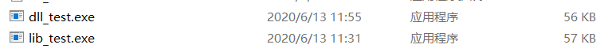

# C++程序的链接

[TOC]


C/C++源代码到最后的可执行文件的流程如上所示

## 预处理阶段

对其中的伪指令（以#开头的指令）和特殊符号进行处理 

伪指令主要包括以下四个方面 

- 宏定义指令，如#define Name TokenString,#undef等。
- 条件编译指令，如#ifdef,#ifndef,#else,#elif,#endif,等等。
- 头文件包含指令，如#include “FileName”或者#include 等。
- 特殊符号，预编译程序可以识别一些特殊的符号。例如在源程序中出现的LINE标识将被解释为当前行号（十进制数），FILE则被解释为当前被编译的C源程序的名称。预编译程序对于在源程序中出现的这些串将用合适的值进行替换。

## 编译阶段

编译的过程就是将预处理完的文件进行一系列词法分析，语法分析，语义分析及优化后生成相应的汇编代码文件(.s文件) 

还记得当时选修了编译原理这门课

## 汇编阶段

汇编器是将汇编代码转变成机器可以执行的代码，每一个汇编语句几乎都对应一条机器指令。最终产生目标文件(.o或.obj文件)。 

对汇编的认识仅仅停留在当时上汇编课时，通过寄存器写双重for循环。。。。。

## 链接阶段

我记得面试腾讯实习时，被问过动态链接和静态链接。

### 静态链接

**由静态链接器将一组可重定位目标文件链接成一个完全连接的、可以加载和运行的可执行目标文件的过程**

#### 静态链接示例

```C++
//add.h
ifndef CPPGUIDE_ADD_H
#define CPPGUIDE_ADD_H

int add(int x,int y);


#endif //CPPGUIDE_ADD_H

```

```c++
//add.cpp

#include "add.h"
#include <iostream>


int add(int x,int y){

    int sum =  x+y;
    std::cout<<sum<<std::endl;
    return sum;

}
```

```c++
//main.cpp
#include "add.h"
#include <iostream>
int main(){
    int a = 10;
    int b = 20;
    int sum = add(a,b);
    std::cout<<sum<<std::endl;
    system("pause");
    return 0;

}
```

```c++
//随后在cmd中进行编译链接，在linux中命令也差不多时一样的
g++ -c add.cpp
ar rv lib_test.lib add.o
g++ -o lib_test.exe main.cpp lib_test.lib 
```


- 我们知道静态链接的话，文件会很大，往往实现很小的一个功能就需要占用很大的空间，而且每次库文件升级的话，都要重新编译源文件，很不方便。具体下面如下：


- 对于静态编译的程序１和程序２，都应用库staticMath。在内存中就又两份相同的staticＭath目标文件，很浪费空间，一旦程序数量过多就很可能会内存不足。      

- 我们知道，链接器在链接静态链接库的时候是以目标文件为单位的。比如我们引用了静态库中的printf()函数，那么链接器就会把库中包含printf()函数的那个目标文件链接进来，如果很多函数都放在一个目标文件中，很可能很多没用的函数都被一起链接进了输出结果中。
- 所以尽量将每个函数独立地放在一个目标文件中可以尽量减少空间的浪费，那些没有被用到的目标文件就不会链接到最终的输出文件中。


#### 静态链接的优点

- 在可执行程序中已经具备了所有执行程序所需要的任何东西，在执行的时候运行速度快。

#### 静态链接的缺点

- 浪费空间：如果多个程序对同一目标文件都有依赖，那么同一目标文件在内存存在多个副本；
- 更新困难：每当库函数的代码修改了，就需要重新进行编译链接形成可执行程序。

### 动态链接


我们看到在这种模型中，两个程序只应用一个库，这个目标文件在内存中只有一份，供所有程序使用。

并且在程序运行过程中动态调用库文件，很方便，又不占空间，但是动态链接有一个缺点就是可移植性太差，如果两台电脑运行环境不同，动态库存放的位置不一样，很可能导致程序运行失败。

上面示例进行动态连接

```c++
//随后在cmd中进行编译链接，在linux中命令也差不多时一样的
g++ add.cpp -shared -o dll_test.dll
g++ dll_test.dll main.cpp -o dll_test.exe
```




**由上图可以看出动态链接形成的可运行程序比静态链接的少，不过这个例子不明显。**

#### 动态链接的优点

- 节省空间：即使需要每个程序都依赖同一个库，但是该库不会像静态链接那样在内存中存在多分，副本，而是这多个程序在执行时共享同一份副本；
- 更新方便，更新时只需要替换原来的目标文件，而无需将所有的程序再重新链接一遍。当程序下一次运行时，新版本的目标文件会被自动加载到内存并且链接起来，程序就完成了升级的目标。

#### 动态链接的缺点

- 因为把链接推迟到了程序运行时，所以每次执行程序都需要进行链接，所以性能会有一定损失。
- 动态链接和静态链接相比，性能损失大约在5%以下。